# 図でわかる運用・構成ガイド（2026）

このページは、既存ドキュメントの文章説明を図で補足するためのガイドです。  
詳細な手順や契約は、各ドキュメント本文を参照してください。

## 1. 運用フロー（データ更新〜画面反映）

Mermaidソース: [`docs/diagrams/operations-flow.mmd`](/Users/hirotoishizuka/Desktop/Jeunesse2026OrientationAccounting/docs/diagrams/operations-flow.mmd)

## 2. 構成ツリー（どこに何があるか）

Mermaidソース: [`docs/diagrams/system-tree.mmd`](/Users/hirotoishizuka/Desktop/Jeunesse2026OrientationAccounting/docs/diagrams/system-tree.mmd)

## 3. 参照先

- 運用手順: [`docs/dashboard-operation.md`](/Users/hirotoishizuka/Desktop/Jeunesse2026OrientationAccounting/docs/dashboard-operation.md)
- JSON契約: [`docs/gas-deploy-and-json-contract.md`](/Users/hirotoishizuka/Desktop/Jeunesse2026OrientationAccounting/docs/gas-deploy-and-json-contract.md)
- シート構成: [`docs/spreadsheet-setup.md`](/Users/hirotoishizuka/Desktop/Jeunesse2026OrientationAccounting/docs/spreadsheet-setup.md)
